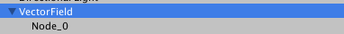
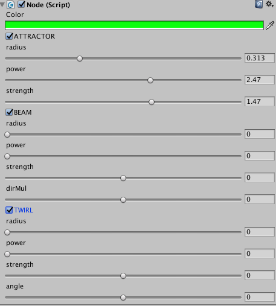
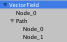
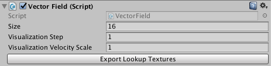
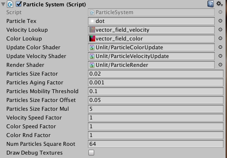

UnityGPUFlow
============

This is a minimal Unity framework that lets you create flowing particles animations. It was originally developed at [**Dpt**](http://dpt.co/) as part of a VR project.

You can design a vector field in the Unity editor, and use it to animate a GPU particle system.

Take a look at the **Demo** scene for a better understanding:

The **vector field** is designed using **nodes**,  

these nodes combine three behaviors (attractor, beam and twirl)    

Nodes may be combined in a **Path**, so they behave as the control points of a spline  

Once the vector field is designed, **export the lookup textures** that will be used to animate the particle system  

Finally, setup the particle system  

